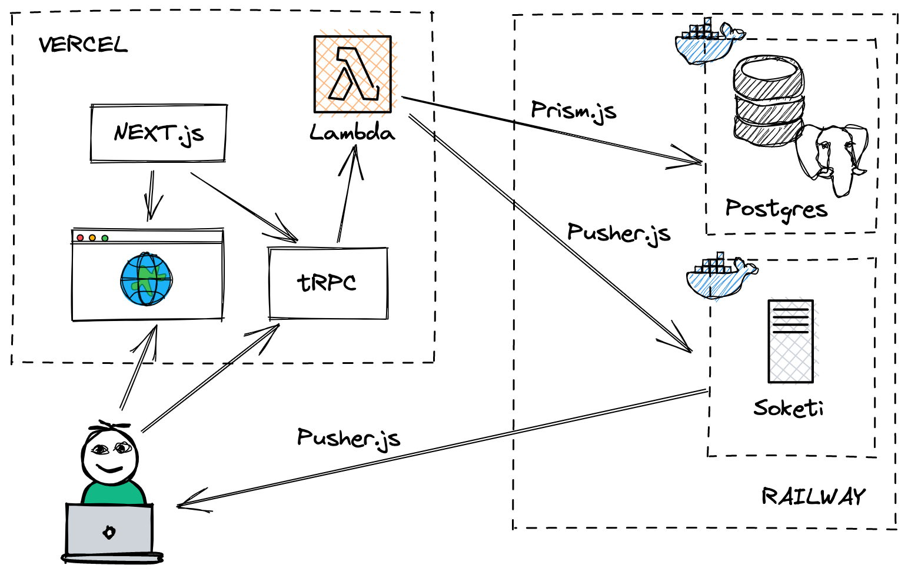

# Create T3 App

This is an app bootstrapped according to the [init.tips](https://init.tips) stack, also known as the T3-Stack.

## The Playground

This is my playground repository where I gathered first experiences with the T3-Stack and coming with it things new to me like, Next.js, Prism, Pusher, Soketi and React.

What got me interested in playing around with the T3-Stack is the powerful setup you get when bootstrapping a new project using `npx create-t3-app@latest`. Still the most interesting part for me was that I learned that it includes [tRPC](https://trpc.io/), which promises easy end-to-end typesafe APIs and a great developer experience. The whole package sounded like an interesting and holistic stack to me so I had to try it out.

The first steps with tRPC and Next.js were so easy and I had so much fun with it that I ended up building a small scrum poker app. Here is what it looks like on a phone.

|                                       |                                      |                                |
| ------------------------------------- | ------------------------------------ | ------------------------------ |
|  |  |  |
|        |        |                                |

I still had to spend quite some time digging into the documentation about React Hooks and Next.js because I did not yet have a good understanding of page pre-rendering in a static generation and client side rendering context. Especially finding a way to ensure that some page components or code never runs on the server but on the client only.



## Getting Started

1. Clone this repository `git clone https://github.com/rschw/t3-app-playground` and rename `.env-example` to `.env`.

2. Configure the `datasource` in `schema.prisma` to either use `sqlite` or `postgres`. When `postgres` is used make sure to spin up a docker container and configure `DATABASE_URL` in `.env`.

```prisma
// sqlite
datasource db {
    provider = "sqlite"
    url      = "file:./db.sqlite"
}

// postgres
datasource db {
    provider = "postgres"
    url      = env("DATABASE_URL")
}
```

3. `npm install` which has a `postinstall` hook that will run `npx prisma generate` for you to create the prisma db schema.

4. `npx prisma db push` to push the db schema to whatever db provider you chose.

5. `npx @soketi/soketi start` to spin up a local websocket server. `.env-example` is preconfigured to use `soketi` defaults.

6. `npm run dev` to start the Next.js dev server.

## Links

- [Create T3 App](https://create.t3.gg/)
- [Next.js](https://nextjs.org/)
- [tRPC](https://trpc.io/)
- [Soketi](https://soketi.app/)
- [Pusher](https://pusher.com/)
- [Vercel](https://vercel.com/)
- [Railway](https://railway.app/)
- [TailwindCSS](https://tailwindcss.com/)
