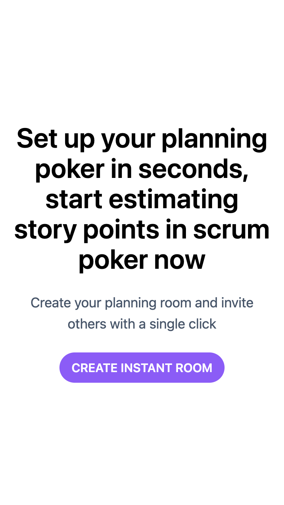
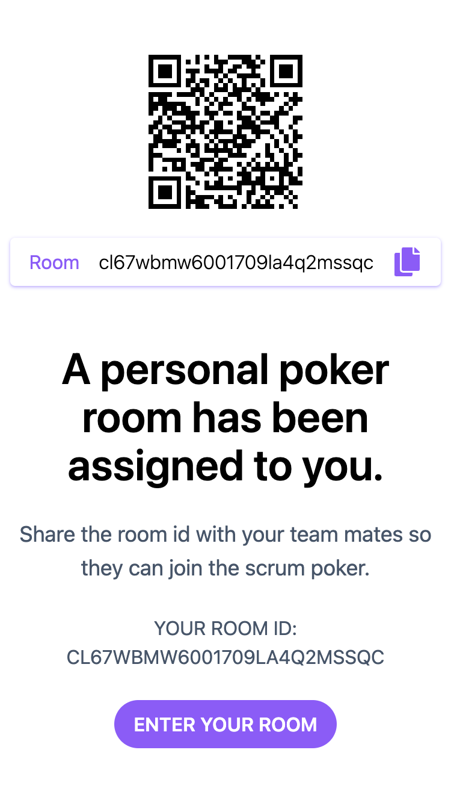
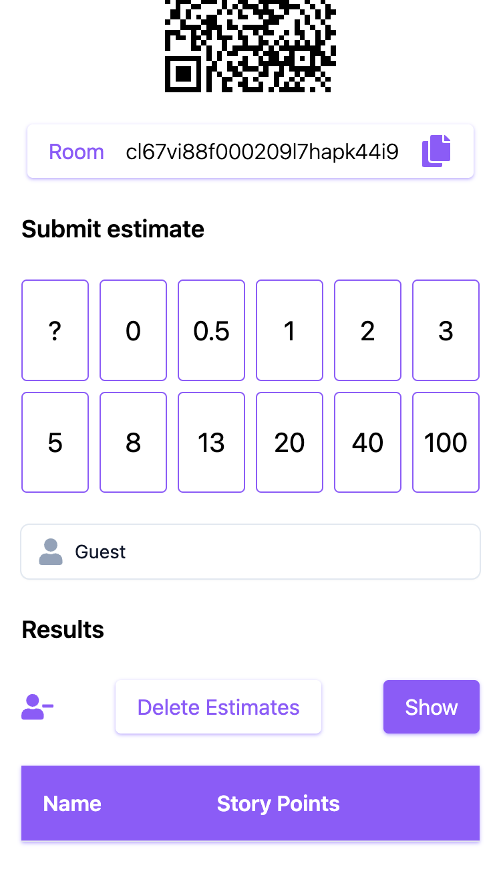
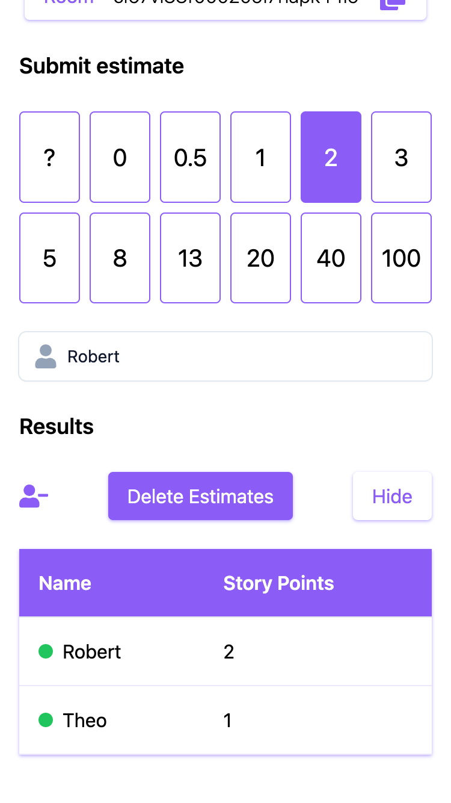

# Create T3 App

This is an app bootstrapped according to the [init.tips](https://init.tips) stack, also known as the T3-Stack.

## The Playground

What got me interested in playing around with the T3-Stack is the powerful setup you get when bootstrapping a new project using `npx create-t3-app@latest`. Still the most interesting part for me was that it includes [tRPC](https://trpc.io/). tRPC promises easy end-to-end typesafe APIs and in fact it delivered and the developer experience feels seamless.

I had so much fun with it that I ended up building a small scrum poker app. Here is what it looks like on a phone.

| | | |
|:---:|:---:|:---|
||||
||||

## Getting Started

Follow the instructions to run the application on your machine.

Clone this repository `git clone https://github.com/rschw/t3-app-playground` and rename `.env-example` to `.env`.

Configure the `datasource` in `schema.prisma` to either use `sqlite` or `postgres`. When `postgres` is used make sure to spin up a docker container and configure `DATABASE_URL` in `.env`.

```prisma
// --> schema.prisma

// sqlite
datasource db {
    provider = "sqlite"
    url      = "file:./db.sqlite"
}

// postgres
datasource db {
    provider = "postgres"
    url      = env("DATABASE_URL")
}
```

Run `npm install` which has a `postinstall` hook that will run `npx prisma generate` for you to create the prisma db schema.

Run `npx prisma db push` to push the db schema to whatever db provider you chose.

Run `npx @soketi/soketi start` to spin up a local websocket server. `.env-example` is preconfigured to use `soketi` defaults.

Run `npm run dev` to start the Next.js dev server.

## Links

- [Soketi](https://soketi.app/) a open-source realtime WebSockets server
- [Pusher](https://pusher.com/) client api connect with `soketi`
- [Vercel](https://vercel.com/) to deploy your `Next.js` app
- [Railway](https://railway.app/) to deploy instance of `postgres` and `soketi`
